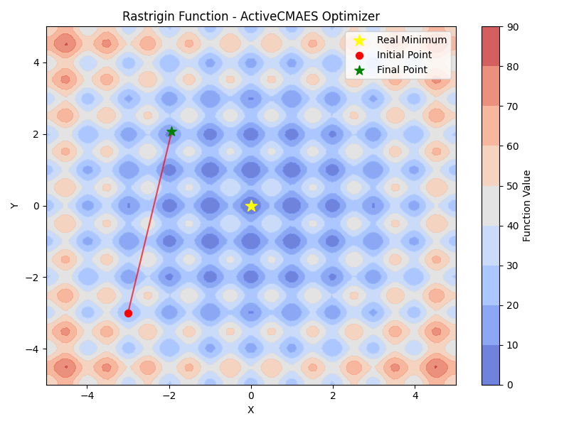
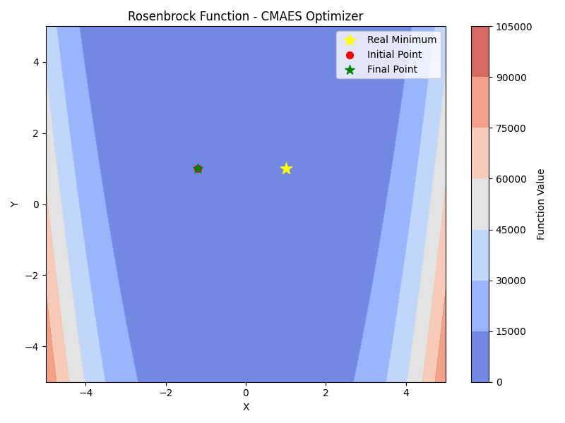

<h2 align="center">
  
</h2>

**Organisation: [mlpack](https://github.com/mlpack)**

**Project: [Integrating Advanced CMA-ES Strategies into mlpack](https://summerofcode.withgoogle.com/programs/2024/projects/Ktk40cAi)**

**Mentors: [Marcus Edel](https://github.com/zoq)**

## Abstract
mlpack is a fast, open-source, flexible C++ machine learning library aiming to provide fast, extensible implementations of cutting-edge machine learning algorithms.
This project focused on enhancing the Covariance Matrix Adaptation Evolution Strategy (CMA-ES) algorithm within mlpack by implementing advanced variants and improving its robustness.

## Goal

1. **[Implement the Increasing Population size CMA-ES (IPOP-CMA-ES) variant](http://www.cmap.polytechnique.fr/~nikolaus.hansen/cec2005ipopcmaes.pdf)**: Create a new function for the IPOP-CMA-ES.
  
2. **[Implement the Bi-population CMA-ES (BIPOP-CMA-ES) variant](https://dl.acm.org/doi/pdf/10.1145/1570256.1570333)**: Even though not initially planned, implementing BIPOP-CMA-ES was relatively easy after setting up IPOP. This variant introduces an interlaced strategy with two mechanisms to change the population size. One similar to IPOP and another that uses a smaller, varying population size.

3. **Enhance the termination criteria for CMA-ES**: Also not originally planned, but after some literature review ([A Restart CMA Evolution Strategy With Increasing Population Size](http://www.cmap.polytechnique.fr/~nikolaus.hansen/cec2005ipopcmaes.pdf) and [The CMA Evolution Strategy: A Tutorial](https://arxiv.org/pdf/1604.00772)), it became apparent to ensure the robustness and correctness the CMA-ES and its variants.

4. **[Implement the Self-Adaptive Surrogate-Assisted CMA-ES (saACM-ES) variant](https://arxiv.org/abs/1204.2356)**: Create a new function for saACM-ES. While this was part of the original plan, it has been left for future work due to the need for several prerequisite components.

## Contributions 

Here is the list of PRs (both open & closed) that I created during GSoC.

| PULL REQUESTS                                             | COMMITS                                                                                                                                                                                                                                                                                                                    | DESCRIPTION                                                                                                                                                                                                                                                                                        | STATUS         |
|-----------------------------------------------------------|----------------------------------------------------------------------------------------------------------------------------------------------------------------------------------------------------------------------------------------------------------------------------------------------------------------------------|----------------------------------------------------------------------------------------------------------------------------------------------------------------------------------------------------------------------------------------------------------------------------------------------------|----------------|
| [#401](https://github.com/mlpack/ensmallen/pull/401) | - [3e96c67](https://github.com/mlpack/ensmallen/commit/3e96c67f16a77df95ad70c36fdc46d21abb57be4)   - [c5f103b](https://github.com/mlpack/ensmallen/commit/c5f103b129a3251687b24ae34ed38e7e4e5f7cbe)   - [718d1c1](https://github.com/mlpack/ensmallen/commit/718d1c1f40db24c62430e624f2303761745f8f13)   - [baf07d9](https://github.com/mlpack/ensmallen/commit/baf07d93f94ef2c546f70452953aea883a7043a7)   - [e8f21e7](https://github.com/mlpack/ensmallen/commit/e8f21e719fa997bf11fb2345895161ae6482e687)   - [ac8adca](https://github.com/mlpack/ensmallen/commit/ac8adcaaefb0c03129112405d9b8252105e575bf)   - [5950e89](https://github.com/mlpack/ensmallen/commit/5950e89fe6a4ea68d45dba6f495de5603bcaf6ec) | Implementation of various stopping conditions for the CMA-ES algorithm, such as stopping based on maximum iterations, target objective value, function evaluation limits, tolerance on function value, fitness stagnation, and several other criteria to ensure robust and reliable convergence. |  Open |
| [#403](https://github.com/mlpack/ensmallen/pull/403) | - [1103561](https://github.com/mlpack/ensmallen/commit/1103561c731524fdc0710f9a506c20f7f40ece35)   - [aba89da](https://github.com/mlpack/ensmallen/commit/aba89da4a36960df1cc74113728c654a4bfff33f)   - [2508bb1](https://github.com/mlpack/ensmallen/commit/2508bb145a0381a0a52478755a70fed9b00c2fa4)   - [762fab9](https://github.com/mlpack/ensmallen/commit/762fab94c597eefc9cfb1e0b08b99fb30496d5eb)   - [942bc37](https://github.com/mlpack/ensmallen/commit/942bc371001cf45fc19377e5cb07a8fa4363243e)   - [8a257b5](https://github.com/mlpack/ensmallen/commit/8a257b5067889e59119601a87a5e707418596170)   - [4d880bb](https://github.com/mlpack/ensmallen/commit/4d880bb53be0345482f17d7642e2b2e52dc8bd92)   - [6bb6af4](https://github.com/mlpack/ensmallen/commit/6bb6af403949bf945a0e69853a1409d79321a666)   - [bdbdc01](https://github.com/mlpack/ensmallen/commit/bdbdc01cbb19503646eeddf58dde878671aa7284) | IPOP introduces a strategy of increasing population size after each optimizer restart to enhance global search. BIPOP combines this with a dual strategy of varying population sizes, optimizing performance across different types of objective functions.                                                                         |  Open |

## Evaluation metrics

In the context of evolutionary algorithms and its variants, evaluating performance across different optimization tasks is crucial. The following images illustrate the effectiveness of the mlpack's implementation on two benchmark functions: Rastrigin and Rosenbrock.

    
    
    
    

## Future plans 
1. **saACM-ES Implementation**: The implementation of Self-Adaptive Surrogate-Assisted CMA-ES (saACM-ES) has been postponed for future work. This is due to the need for several prerequisite components:
   - Kernelized SVM implementation
   - Modified kernelized SVM for ranking
2. **Ongoing Maintenance**: Continued work on addressing any issues that arise in the CMA-ES implementation.

## Acknowledgement 
I want to express my gratitude to my mentor, Marcus Edel and the entire mlpack community for their constant support and guidance throughout this project. Their patience and suggestions were invaluable in overcoming challenges and pushing the project forward.